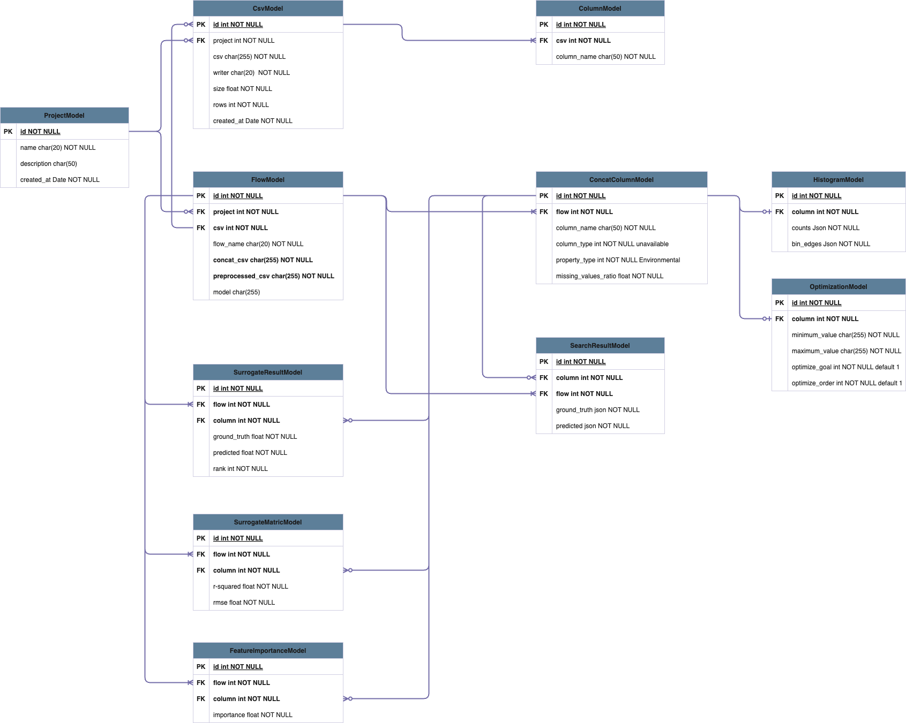
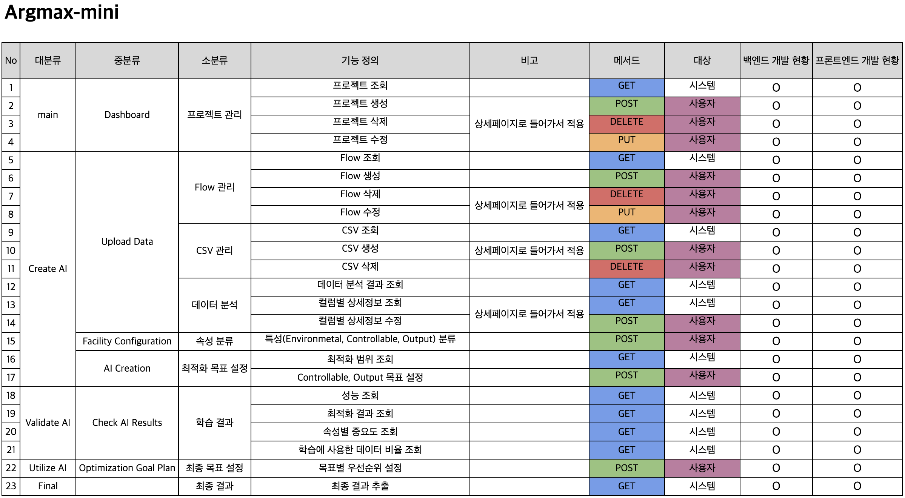

# ArgMax Mini

## 📖 소개
**ArgMax Mini**는 데이터 처리 및 최적화 작업을 위한 Django 기반 웹 애플리케이션입니다.  
데이터 수집, 전처리, 최적화 분석 등을 수행하며, 이를 RESTful API 형태로 제공합니다.

---

## 📂 프로젝트 구조
```
.
├── Dockerfile               # Docker 컨테이너 설정 파일
├── README.md                # 프로젝트 설명 문서
├── argmax_mini              # Django 프로젝트 루트 폴더
│   ├── asgi.py              # ASGI 설정 파일
│   ├── settings.py          # Django 프로젝트 설정 파일
│   ├── urls.py              # URL 라우팅 설정
│   └── wsgi.py              # WSGI 설정 파일
├── data_processing          # 주요 데이터 처리 및 최적화 기능
│   ├── migrations           # 데이터베이스 마이그레이션 파일
│   ├── serializers.py       # 데이터 직렬화 설정
│   ├── urls.py              # API 라우팅 설정
│   ├── models/              # 데이터 모델 정의
│   ├── views/               # API 뷰 로직
│   └── tests/               # 테스트 코드
├── manage.py                # Django 관리 명령어 실행 파일
└── requirements.txt         # 프로젝트 의존성 목록
```

---

## 📊 데이터베이스 설계 (ERD)
다음은 프로젝트의 데이터베이스 ERD(Entity Relationship Diagram)입니다.



---

## 🏗 기능 명세서
아래는 시스템 기능 명세서입니다.



---

## 🚀 주요 기능
- **데이터 수집 및 전처리**: CSV 데이터를 업로드하고, 컬럼 및 데이터 변환을 수행
- **최적화 알고리즘 적용**: 목표 함수 기반 최적화 수행
- **서로게이트 모델(Surrogate Model) 분석**: 머신러닝 모델을 활용한 대체 평가
- **RESTful API 제공**: 데이터 처리 및 최적화 기능을 API로 제공
- **Docker 컨테이너 지원**: 컨테이너 환경에서 실행 가능

---

## ⚙️ 설치 방법
### 1️⃣ 프로젝트 클론
```bash
git clone https://github.com/your-repo/argmax-mini.git
cd argmax-mini
```

### 2️⃣ 가상 환경 설정 및 패키지 설치
```bash
python -m venv venv
source venv/bin/activate  # macOS/Linux
venv\Scripts\activate      # Windows

pip install -r requirements.txt
```

### 3️⃣ 데이터베이스 마이그레이션
```bash
python manage.py migrate
```

### 4️⃣ 개발 서버 실행
```bash
python manage.py runserver
```
- 기본적으로 `http://127.0.0.1:8000/` 에서 실행됩니다.

---

## 🐳 Docker 사용법
### 1️⃣ Docker 이미지 빌드
```bash
docker build -t argmax-mini .
```

### 2️⃣ 컨테이너 실행
```bash
docker run -p 8000:8000 --gpus all -t argmax-mini:latest argmax-mini
```

---

## 🔗 API 사용법
API는 RESTful 방식으로 제공됩니다.

### ✅ CSV 파일 업로드 예제 (POST /api/upload/)
```bash
curl -X POST "http://127.0.0.1:8000/api/upload/" \
     -H "Content-Type: multipart/form-data" \
     -F "csv_file=@data.csv" \
     -F "writer=example_user" \
     -F "project_id=1"
```
**📌 설명**
- `csv_file`: 업로드할 CSV 파일 (`@data.csv` → 실제 파일 경로 지정)
- `writer`: CSV 파일을 업로드하는 사용자명 (예: `example_user`)
- `project_id`: CSV 파일이 속한 프로젝트 ID (예: `1`)

---

### ✅ 업로드된 CSV 파일 조회 (GET /api/upload/)
```bash
curl -X GET "http://127.0.0.1:8000/api/upload/?project_id=1" \
     -H "Accept: application/json"
```
**📌 설명**
- `project_id`: 조회할 프로젝트 ID (예: `1`)

---

## 📚 환경 변수 및 설정
- `DEBUG` (기본값: `True`) → 개발 모드 설정
- `DATABASE_URL` → 데이터베이스 연결 정보
- `ALLOWED_HOSTS` → 허용된 호스트 설정

---

## 📦 의존성 목록
`requirements.txt`에 포함된 주요 라이브러리:
- **Django**: 백엔드 웹 프레임워크
- **Django REST Framework**: API 개발을 위한 라이브러리
- **Pandas**: 데이터 분석 라이브러리
- **NumPy**: 과학 연산을 위한 라이브러리
- **Scikit-Learn**: 머신러닝 모델 적용

설치된 전체 라이브러리는 `requirements.txt`에서 확인할 수 있습니다.

---

## 🛠️ 테스트 실행 방법
```bash
python manage.py test data_processing.tests
```
특정 테스트 파일 실행:
```bash
python manage.py test data_processing.tests.test_analytics
```

---


## 📧 문의
- 프로젝트 관련 문의: **mu07010@gmail.com**
- 개발자 깃허브: [https://github.com/taeyoung1005](https://github.com/taeyoung1005)
